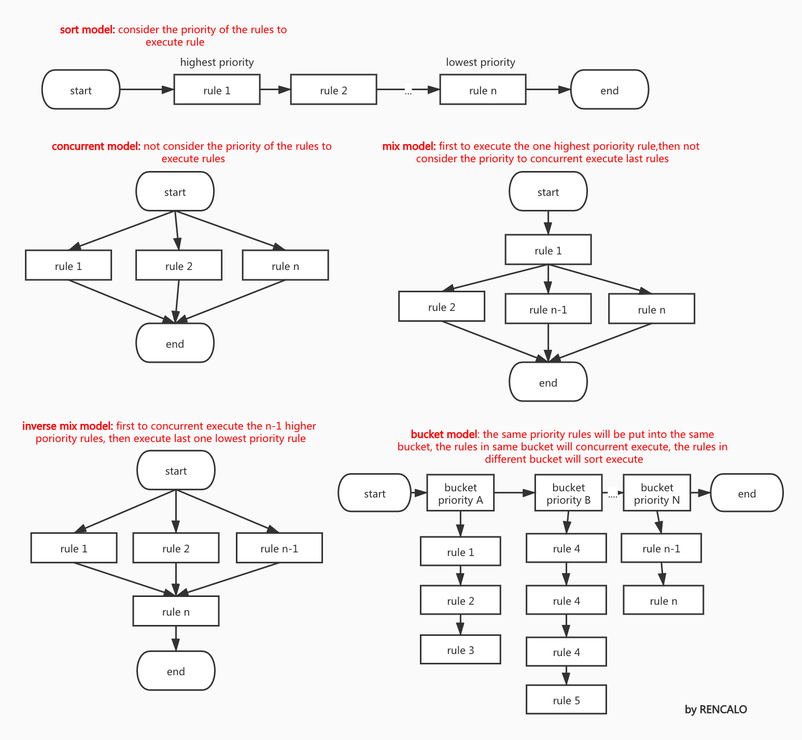

# 规则的执行模式

如图,规则的执行模式有5大类,gengine支持前3类(顺序执行模式、并发执行模式、混合执行模式),以及基于这3类衍生出的子执行模式.


### 顺序执行模式
gengine中加载的规则,基于优先级排序,规则从优先级高到优先级低,依次顺序执行. 此模式下,优先级是优先的考量因素.<font color=red >当用户没有显式的指明优先级时,规则的优先级未知, 如果多个规则的优先级相同，那么在执行的时候，相同优先级的规则执行顺序未知</font>

### 并发执行模式
gengine中加载的规则,不考虑优先级,规则与规则之间并发执行.此模式主要是基于性能考量.

### 混合模式
gengine中加载的规则,选取一个最高优先级规则最先执行,剩下的n-1个规则并发执行.此模式结合优先级和性能的双重考量.

### 逆混合模式
- gengine中加载的规则,选取优先级最高的n-1个规则并发执行, 这个n-1个规则执行完毕之后,剩下的最后一个优先级最低的规则开始执行; 如果前n-1个规则并发执行无异常，则继续执行最后一个规则.
- 1.3.7版本中开始支持
- 测试用例: https://github.com/rencalo770/gengine/blob/master/test/inverse_mix_model_test.go

### 具体支持的模式说明
- 所有的规则执行方法在此文件中  https://github.com/rencalo770/gengine/blob/master/engine/gengine.go 

| 方法 | 执行模式 | 说明 | 
| -------- | :--------: | :-------------------- |
|```Execute```|顺序模式| 当b=true,表示如果规则链中有一个规则执行出错,会继续执行剩下的规则; <br/>当b=false,表示如果规则链中有一个规则执行出错,将不会继续执行剩下的规则|
|```ExecuteWithStopTagDirect```|顺序模式|当b=true,表示如果规则链中有一个规则执行出错,会继续执行剩下的规则;<br/> 当b=false,表示如果规则链中有一个规则执行出错,将不会继续执行剩下的规则;<br/>当执行某个规则之后,不想继续执行后的规则,可以直接使用sTag结构体中的标识位来停止执行后面的规则:<br/> stag.StopTag=true,表示停止后面的规则;<br/> stag.StopTag=false,无任何影响,退化成```Execute```|
|```ExecuteConcurrent``` |并发模式|并发执行gengine中的所有规则,在并发过程中,如果有规则执行错误,会被log下来|
|```ExecuteMixModel```|混合模式|先选取优先级最高的一条规则执行,然后并发执行剩下的规则,如果第一个规则执行有error,则不会再执行后面的规则|
|```ExecuteMixModelWithStopTagDirect```|混合模式|先选取优先级最高的一条规则执行,然后并发执行剩下的规则;<br/>当用户执行完了最高优先级的一条规则,如果不想执行剩下的规则,可以直接使用sTag结构体中的标识位来停止执行后面的规则:<br/> stag.StopTag=true,表示停止后面的规则;<br/> stag.StopTag=false,无任何影响,退化成```ExecuteMixModel```|
|```ExecuteSelectedRules```|顺序模式|用户可以使用规则名,直接选择指定的规则来执行,被选取的规则基于优先级顺序执行|
|```ExecuteSelectedRulesConcurrent```|并发模式|用户可以使用规则名,直接选择指定的规则来执行,被选取的规则并发执行|
|```ExecuteSelectedRulesMixModel```|混合模式|用户可以使用规则名,直接选择指定的规则来执行,被选中的规则使用混合模式执行,如果第一个规则执行有error,则不会再执行后面的规则|
|```ExecuteInverseMixModel```|逆混合模式|选取优先级最高的n-1个规则并发执行,这个n-1个规则执行完毕之后,剩下的最后一个优先级最低的规则开始执行; 如果前n-1个规则执行无异常，则继续执行最后一个规则|
|```ExecuteSelectedInverseMixModel```|逆混合模式|用户可以使用规则名,直接选择指定的规则来执行;假设用户选取了m个规则, 则选取优先级最高的m-1个规则并发执行,这个m-1个规则执行完毕之后,剩下的最后一个优先级最低的规则开始执行; 如果前m-1个规则执行无异常，则继续执行最后一个规则|

```ExecuteSelectedRules``` , ```ExecuteSelectedRulesConcurrent```,```ExecuteSelectedRulesMixModel```和```ExecuteSelectedInverseMixModel``` 几个方法还会在后续详细讨论


