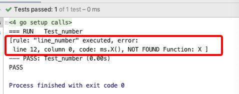

# 报错时支持行号提示
- gengine是规则引擎, 同时也可认为是一门开放的语言. 
- 为了用户在使用过程中,获得更好的体验,gengine在很早的版本中,就支持了在规则执行出错时,提示出具体的行与列,帮助用户更快的排查具体的问题

## 出错示例

- 代码示例
```go 

import (
	"fmt"
	"gengine/builder"
	"gengine/context"
	"gengine/engine"
	"testing"
)


var lineNumberRules = `
rule "line_number"  "when execute error,gengine will give out error"
begin

//Println("golang", "hello", "world" )

//取消斜杠注释,依次测试不同的报错情况
//if Println("golang", "hello") == 100 {
// 	Println("golang", "hello")
//}

ms.X()

end
`

type MyStruct struct {

}

func (m *MyStruct)XX(s string)  {
	println("XX")
}


func Println(s1, s2 string) bool {
	println(s1, s2)
	return false
}


func Test_number(t *testing.T) {
	dataContext := context.NewDataContext()
	//注入自定义函数
	dataContext.Add("Println", Println)
	ms :=  &MyStruct{}
	dataContext.Add("ms", ms)

	ruleBuilder := builder.NewRuleBuilder(dataContext)
	e1 := ruleBuilder.BuildRuleFromString(lineNumberRules)
	if e1 != nil {
		panic(e1)
	}

	eng := engine.NewGengine()
	// true: means when there are many rules, if one rule execute error,continue to execute rules after the occur error rule
	e2 := eng.Execute(ruleBuilder, true)
	if e2 != nil {
		println(fmt.Sprintf("%+v", e2))
	}
}

```

- 测试代码位置:https://github.com/rencalo770/gengine/blob/master/test/line_number/line_number_test.go
- 测试结果




  
